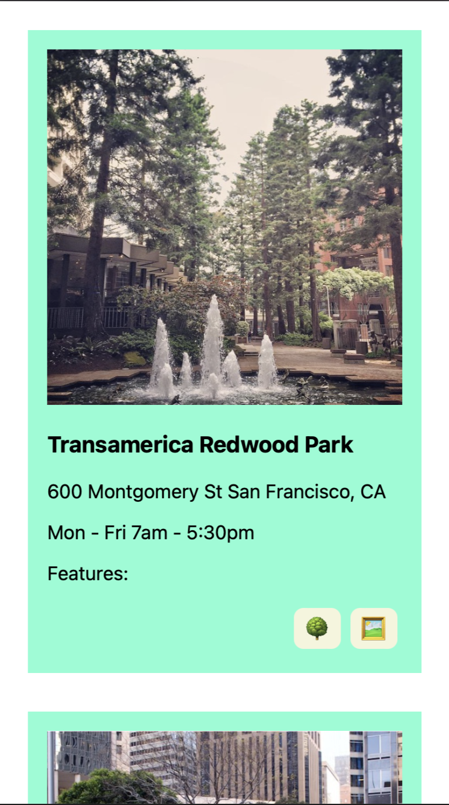
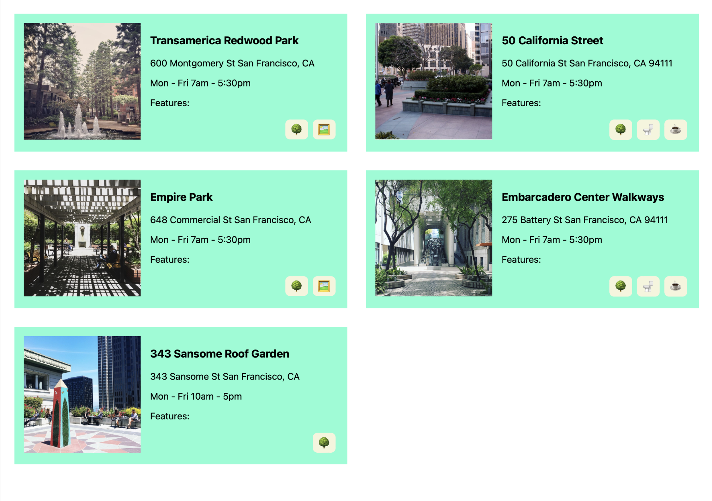

# Responsive Web Design Challenge 

Your goal is to recreate the images below using the markup and images provided. 

Mobile

The images should be 100%. Notice all of the articles are arranged in a single column. The content within an article is arranged vertically. The icons are aligned on the right. 

Desktop

The images here are 200px. The content in the article is arranged in two columns with the image on the left and content on the right. The icons are are aligned to the right. 
